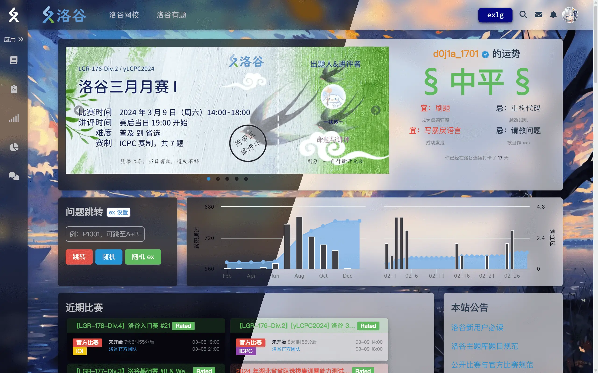
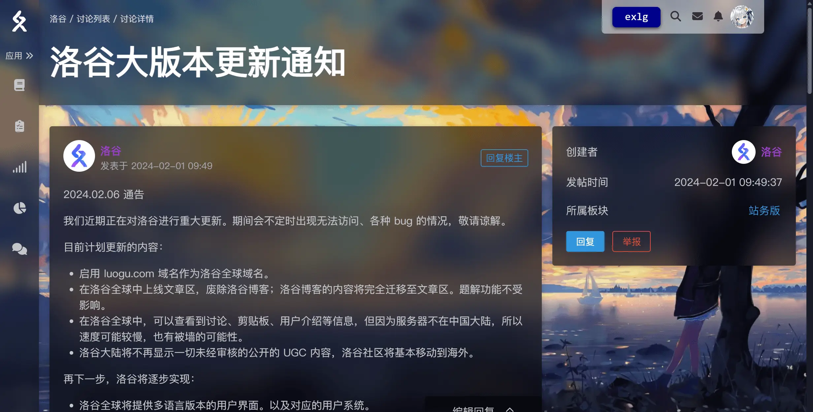
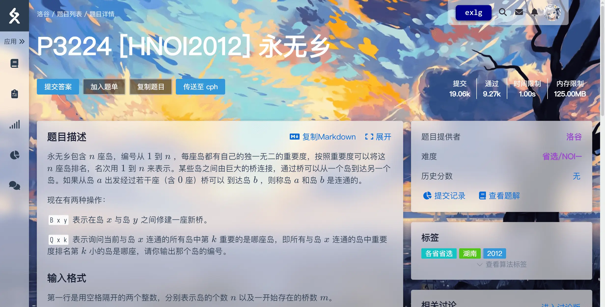
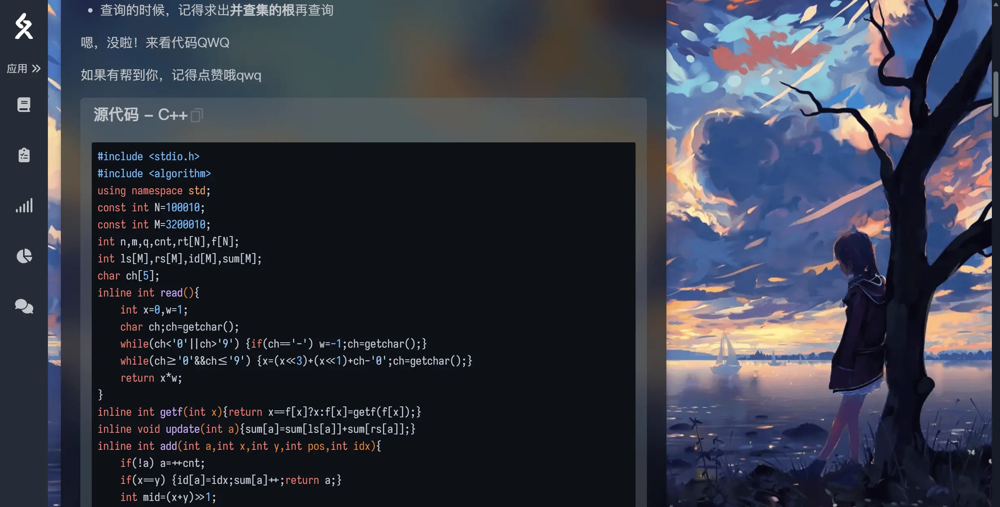

# 氩洛谷预览版

适用于[洛谷](https://www.luogu.com.cn)的美化样式。

A beautification style for [Luogu](https://www.luogu.com.cn).

[简体中文](./README-EN.md)|[English](./README-EN.md)

---

**特性列表：**
1. 内置亮/暗两种配色
2. 支持自定义颜色
3. 支持自定义字体
4. 支持自定义背景图片
5. 可开关的亚克力效果
6. 与 extend-luogu 兼容

**如何安装：**
1. 在此之前，你需要一个浏览器插件「[Stylus](https://chromewebstore.google.com/detail/stylus/clngdbkpkpeebahjckkjfobafhncgmne)」，该插件允许你为网页添加自定义样式表。（这个插件非常常见，如果你无法访问谷歌，只需直接搜索「Stylus 插件安装」并遵循说明使用开发者模式安装即可）
2. 安装完成后，在[这个网页](https://userstyles.world/style/12397/argon-luogu-dev)上点击 `Install` 安装样式表。

**效果预览：**

